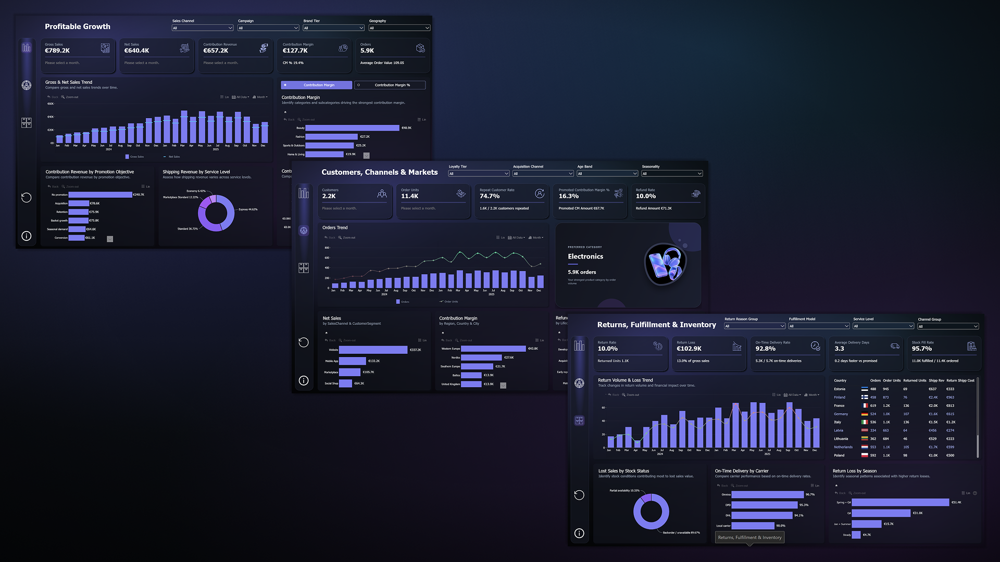

# E-Commerce Analytics Dashboard


A decision-ready Power BI report built for the ZoomCharts Power BI Challenge. The dashboard analyzes European e-commerce performance from gross sales through contribution margin, helping stakeholders understand where growth creates value and where discounts, returns, delivery issues, and stock constraints reduce it.

## 1. Introduction

E-commerce growth is not only about selling more products. It is about understanding what remains after discounts, refunds, product costs, logistics, payment fees, marketing allocation, and return-related losses.

This project combines transaction, product, customer, market, promotion, fulfillment, and return data into an interactive Power BI report. The result is a three-page analytical experience focused on profitable growth, customer and market performance, and operational value leakage.

## 2. Problem Statement

The business needs to answer eight connected questions:

- How are gross sales, net sales, contribution revenue, and contribution margin changing over time?
- Which departments, categories, subcategories, products, brands, and price tiers generate the strongest revenue and margin?
- Which products, customer groups, and return reasons drive refunds, reverse-logistics costs, processing costs, and return losses?
- Which campaigns and discount levels support profitable growth, and where do promotions weaken contribution margin?
- How do customer segments, loyalty tiers, acquisition channels, age groups, cohorts, and lifecycle stages differ in sales and profitability?
- How do website, mobile app, marketplace, and social commerce channels perform across European markets?
- How do fulfillment models, centers, carriers, and service levels compare by cost, delivery speed, and on-time performance?
- Where do low stock, partial availability, and backorders cause cancelled orders, unfulfilled demand, and lost sales value?

## 3. Skills Demonstrated

- Power BI dashboard design and business storytelling
- Star-schema modeling for transactional analytics
- Power Query data ingestion and transformation
- DAX measures for revenue, margin, returns, inventory, customers, and delivery performance
- Time-intelligence analysis, including month-over-month comparisons
- Interactive analysis with slicers, drill-downs, cross-filtering, and ZoomCharts visuals
- KPI design with dynamic reference labels and conditional formatting
- HTML-based KPI design with CSS animation and direct image URLs
- Image URL categorization for geographic flag visuals
- Profitability analysis beyond top-line sales
- Translating analytical results into operational recommendations

## 4. Data Sourcing

The project uses the European e-commerce profitability challenge dataset supplied for the ZoomCharts Power BI Challenge. The data covers 2024-2025 and contains more than 9,000 order-line records.

| Table | Content |
| --- | --- |
| `FactOrderLine` | 9,109 order lines with quantities, price, discount, refund, shipping, product cost, fulfillment, payment fee, marketing and return costs, contribution revenue and margin, lost sales value, return loss, delivery days and on-time flag |
| `DimProduct` | 60 products across 2 departments, 5 categories, 15 subcategories, 10 brands and 3 brand tiers (Value, Core, Premium) |
| `DimCustomer` | 2,200 customers with segment, loyalty tier, acquisition channel, age band, cohort and preferred category |
| `DimGeography` | 6 regions, 12 countries, 24 cities |
| `DimPromotion` | 10 promotion records (9 campaigns plus "No promotion") with objective, discount type and rate |
| `DimSalesChannel` | Website, Mobile App, Marketplace and Social Shop, grouped into 3 channel groups, with payment fee rates |
| `DimFulfillment` | 3 fulfillment models, 6 centers, 5 carriers and 4 service levels |
| `DimReturnReason` | Return reasons grouped into fit/preference, product quality, expectation gap and fulfillment issue |
| `DimCohortAge` | Months since first purchase (0 to 24+) mapped to lifecycle stages |
| `DimDate` | Calendar table used for all time analysis |


Key data points include:

- Order-line transactions, order dates, status, quantities, and currencies
- Gross sales, discounts, refunds, net sales, and shipping revenue
- Product cost, outbound shipping, return shipping, fulfillment, payment, and marketing costs
- Contribution revenue, contribution margin, return loss, and lost sales value
- Product departments, categories, subcategories, brands, price tiers, and return risk
- Customer segments, loyalty tiers, acquisition channels, age bands, cohorts, and lifecycle stages
- European regions, countries, and cities
- Promotions, campaigns, discount types, traffic quality, and free-shipping flags
- Fulfillment models, centers, carriers, service levels, delivery speed, and on-time flags
- Stock status, opening stock, ordered units, fulfilled units, and returned units

The source workbook is included in the project folder as `ecommerce_profitability_challenge_data.xlsx`.

[ZoomCharts Power BI Challenges](https://zoomcharts.com/en/microsoft-power-bi-custom-visuals/challenges/)

## 5. Data Transformation

Power Query loads the workbook sheets into dimension and fact tables, promotes headers, applies data types, and prepares the model for analysis. The core business calculations are implemented as DAX measures so they remain responsive to slicers and visual interactions.

### Core DAX Measures

#### Sales and profitability

```DAX
Gross Sales =
SUM(FactOrderLine[GrossSales])

Net Sales =
SUM(FactOrderLine[NetSales])

Contribution Revenue =
SUM(FactOrderLine[ContributionRevenue])

Contribution Margin =
SUM(FactOrderLine[ContributionMargin])

Contribution Margin % =
DIVIDE([Contribution Margin], [Contribution Revenue])

Orders =
DISTINCTCOUNT(FactOrderLine[OrderID])

Average Order Value =
DIVIDE([Net Sales], [Orders])
```

#### Returns, delivery, and inventory

```DAX
Return Rate =
DIVIDE([Returned Units], [Fulfilled Units])

On-Time Delivery Rate =
DIVIDE(
    SUM(FactOrderLine[OnTimeFlag]),
    COUNT(FactOrderLine[DeliveryDateKey])
)

Stock Fill Rate =
DIVIDE(
    SUM(FactOrderLine[FulfilledQuantity]),
    SUM(FactOrderLine[OrderedQuantity])
)

Return Loss =
SUM(FactOrderLine[ReturnLoss])

Lost Sales Value =
SUM(FactOrderLine[LostSalesValue])
```

#### Customer and promotion analysis

```DAX
Customers =
DISTINCTCOUNT(FactOrderLine[CustomerKey])

Repeat Customers =
COUNTROWS(
    FILTER(
        VALUES(DimCustomer[CustomerKey]),
        CALCULATE([Orders]) > 1
    )
)

Repeat Customer Rate =
DIVIDE([Repeat Customers], [Customers])

Promoted Net Sales =
CALCULATE(
    [Net Sales],
    FactOrderLine[IsPromoted] = 1
)

Promoted Contribution Margin % =
DIVIDE(
    CALCULATE([Contribution Margin], FactOrderLine[IsPromoted] = 1),
    CALCULATE([Contribution Revenue], FactOrderLine[IsPromoted] = 1)
)
```

#### Month-over-month analysis

The report uses the selected date hierarchy context and compares the latest selected month with the previous month. The labels return a readable period, directional arrow, currency change, and percentage change.

```DAX
MoM Gross Sales Amount =
VAR SelectedMonths =
    CALCULATETABLE(
        VALUES(DimDate[YearMonth]),
        ALLSELECTED(DimDate)
    )
VAR LastMonth =
    MAXX(SelectedMonths, DimDate[YearMonth])
VAR PreviousMonth =
    EDATE(LastMonth, -1)
VAR CurrentValue =
    CALCULATE(
        [Gross Sales],
        REMOVEFILTERS(DimDate),
        DimDate[YearMonth] = LastMonth
    )
VAR PreviousValue =
    CALCULATE(
        [Gross Sales],
        REMOVEFILTERS(DimDate),
        DimDate[YearMonth] = PreviousMonth
    )
RETURN
    CurrentValue - PreviousValue

MoM Gross Sales % =
DIVIDE(
    [MoM Gross Sales Amount],
    CALCULATE(
        [Gross Sales],
        REMOVEFILTERS(DimDate),
        DimDate[YearMonth] = EDATE(MAX(DimDate[YearMonth]), -1)
    )
)
```

Equivalent MoM measures are used for Net Sales and Contribution Revenue. The report also includes dynamic euro and decimal formatting functions for KPI labels and visual values.

## 6. Modeling

The model follows a star-schema design:

- `FactOrderLine` is the central transaction table.
- `DimDate` provides the active order-date relationship and time hierarchy.
- `DimProduct` stores product and category attributes.
- `DimCustomer` stores customer, cohort, lifecycle, and loyalty attributes.
- `DimGeography` stores region, country, and city attributes.
- `DimPromotion` stores campaign and discount attributes.
- `DimSalesChannel` stores website, mobile app, marketplace, and social commerce attributes.
- `DimFulfillment` stores fulfillment model, carrier, center, and service-level attributes.
- `DimReturnReason` stores return classifications.
- `DimCohortAge` supports lifecycle and cohort analysis.
- `Customer Metrics` and `Data Dictionary` support report navigation and documentation.
- `_Measure` stores organized DAX measures and reference labels.

The fact table has active, single-direction relationships to the relevant dimensions. Keys are retained as separate columns so dimension filters propagate predictably to order-line metrics. The date table is marked as a date table and includes year, quarter, month, week, and day fields for drill-down analysis.

The model was validated for core financial values and relationship coverage. The fact table contains 9,109 order lines, and the key dimensions have no observed orphaned keys in the validation checks.

## 7. Analysis & Visualization

The report is organized into three pages, each designed around a different business decision.

### Page 1: Profitable Growth

Visuals and purpose:

- Monthly line charts track gross sales, net sales, and contribution revenue over time.
- Contribution margin and margin percentage visuals show whether revenue converts into profitable growth.
- Category and department bar charts compare revenue and contribution margin.
- Promotion and discount analysis shows where sales lift is accompanied by margin pressure.
- ZoomCharts Drill Down Timeline Pro supports interactive date hierarchy exploration.
- MoM reference labels display the selected period, up/down arrow, euro movement, and percentage change.

Key insight:

- Total gross sales are approximately EUR 789.2K, while net sales are approximately EUR 640.4K.
- Contribution revenue is approximately EUR 657.2K and contribution margin is approximately EUR 127.7K, equivalent to a 19.4% contribution margin rate.
- Electronics has the highest net sales at approximately EUR 224.8K but only a 2.8% contribution margin rate. Beauty generates approximately EUR 48.9K in contribution margin at a 46.3% margin rate.
- This indicates that sales volume alone is not a sufficient growth target; category mix and margin quality matter.

### Page 2: Customers, Channels & Markets

Visuals and purpose:

- Channel bar charts compare website, mobile app, marketplace, and social commerce performance.
- Geographic visuals compare countries, regions, and cities by sales and contribution margin.
- Customer segment and loyalty visuals compare value, repeat behavior, and profitability.
- Cohort and lifecycle visuals show how customer value changes after acquisition.
- Reference labels provide customer counts, order quantity, promoted margin, and repeat-customer context.

Key insight:

- The website produces the largest net sales contribution at approximately EUR 337.2K and approximately EUR 73.4K in contribution margin.
- The mobile app has a stronger contribution margin rate at approximately 24.2% than the website at approximately 21.2%.
- Marketplace and social commerce have lower contribution margin rates, approximately 12.0% and 12.6%, respectively, suggesting a need to review fees, discounting, and acquisition costs.
- Loyal and Growth customers show repeat rates above 95%, while New customers are at approximately 39.9%. Conversion and onboarding are therefore key opportunities for increasing future customer value.

### Page 3: Returns, Fulfillment & Inventory

Visuals and purpose:

- Return-reason bars identify the causes of refunds and return losses.
- Product and category visuals locate return concentration.
- Carrier and fulfillment comparisons show delivery speed, cost, and on-time performance.
- Stock-status visuals show the relationship between availability, fill rate, and lost sales value.
- KPI reference labels explain returned units, return loss, on-time deliveries, and fulfilled units in context.

Key insight:

- Return rate is approximately 10.0%, with return loss of approximately EUR 102.9K.
- Changed mind, defective product, and size or fit issues are among the largest return-loss drivers. These should be addressed through product information, sizing guidance, quality control, and targeted retention workflows.
- Overall on-time delivery is approximately 92.8% and stock fill is approximately 95.7%, but carrier performance varies.
- Omniva has approximately 96.7% on-time delivery, while GLS is approximately 84.0%. Carrier-level monitoring can improve service quality without treating all fulfillment providers equally.
- Lost sales value is approximately EUR 36.7K, showing that availability and fulfillment constraints are measurable sources of value leakage.

### KPI and interaction design

- KPI cards use dynamic reference labels instead of isolated numbers.
- Currency values use euro formatting with T, B, M, and K units.
- Quantity and customer values use decimal unit formatting.
- MoM labels change when users select or cross-filter months in the ZoomCharts date hierarchy.
- Positive, negative, and neutral MoM changes use conditional colors and directional arrows.
- The Preferred Category HTML KPI uses a 697 x 360 layout with text on the left, a category illustration on the right, a gradient background, and animated interaction states.
- Country flag URLs are categorized as `ImageUrl` for geographic visuals.

You can interact with report here [4U Report](https://app.powerbi.com/view?r=eyJrIjoiMWM1ZjYwYjktMjA1OC00NTVmLWI5MDEtYjhiNzUyNDA2YWU3IiwidCI6IjQ2NTRiNmYxLTBlNDctNDU3OS1hOGExLTAyZmU5ZDk0M2M3YiIsImMiOjl9)



## 8. Conclusion

The business is growing fast and margins are improving, but profit is being held back by four fixable issues: deep discounts, low-margin Electronics, Fashion returns and stock availability. Recommended actions:

1. **Cap discounts at 10-15%.** Retire Clearance 35% and Weekend Flash 25%, and put the budget into Bundle & Save and loyalty offers.
2. **Fix Electronics before Q4.** Reprice or renegotiate cost for negative-margin Tech items and raise safety stock, since Electronics drives half of lost sales.
3. **Cut Fashion returns.** Add size guides and fit tools, and tighten quality and packaging checks to reduce defective and damaged returns.
4. **Shift growth toward higher-margin channels.** Prioritize the mobile app, website, organic search and CRM over marketplace and paid social, and use loyalty programs to convert New and At Risk customers into repeat buyers.
5. **Fix delivery weak spots.** Review the GLS / Madrid Hub contract for Spain and Italy, and reserve Express for orders that can absorb the extra shipping cost.

## 9. Recommendation

Shift growth investment toward high-margin categories and mobile-app or loyal-customer opportunities, while reducing value leakage through targeted electronics margin actions, return-prevention initiatives, carrier performance management, and stock availability improvements.

## Project Contents

- `ecommerce_profitability_challenge_data.xlsx`: source challenge dataset
- `Readme.md`: project documentation
- Power BI report: interactive dashboard containing the three analytical pages, DAX measures, ZoomCharts visuals, KPI labels, and HTML KPI design

## Related Resources

- [ZoomCharts Power BI Challenges](https://zoomcharts.com/en/microsoft-power-bi-custom-visuals/challenges/)
- [Data Source](ecommerce_profitability_challenge_data.xlsx)
